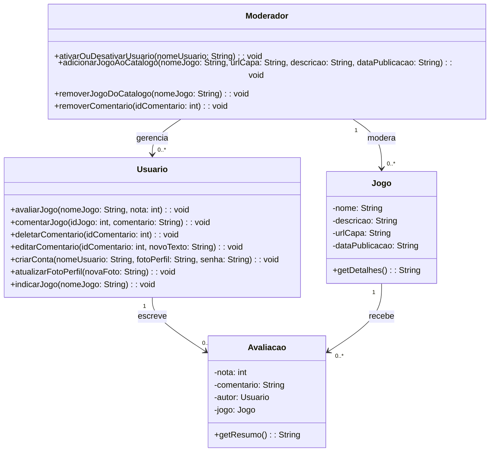

# 🎮 Sistema de Indicação de Jogos

Este projeto é um sistema de indicação de jogos desenvolvido com **Spring Boot** no back-end e **React** no front-end para trabalho semestral do curso de Desenvolvimento de Software Multiplataforma na FATEC Mauá. Usuários podem cadastrar, visualizar e recomendar jogos, além de curtir as indicações de outros usuários.

---

## 🚀 Tecnologias Utilizadas

### Back-end (Java + Spring Boot)
- Spring Boot
- Spring Web
- Spring Data JPA
- Banco de Dados: H2
---

## 🛠️ Funcionalidades

- ✅ Cadastro de jogos com título, gênero, descrição e imagem
- ✅ Listagem dos jogos recomendados
- ✅ Sistema de likes nas recomendações
- ✅ Interface amigável com React
- ✅ Integração entre front-end e back-end via API REST

---

## Modelagem UML de classe

---
